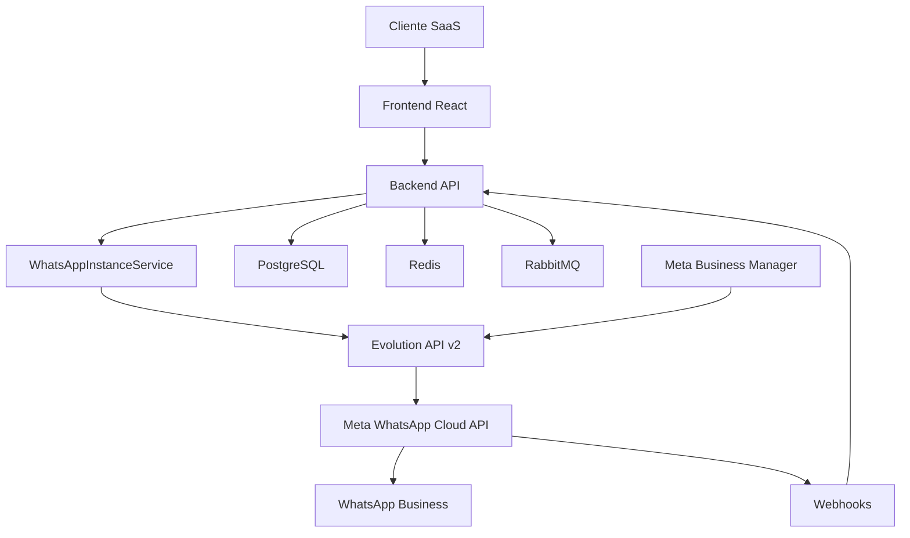

# ✅ WhatsApp Cloud API Integration - CONCLUÍDA

## 🎉 Status: IMPLEMENTAÇÃO COMPLETA

A integração WhatsApp Cloud API oficial via Evolution API v2 foi **100% implementada** com sucesso!

## 📋 Resumo da Implementação

### ✅ **1. Infraestrutura Docker**
- **Evolution API v2** container configurado (porta 8080)
- **Database integration** com PostgreSQL
- **Redis caching** para performance
- **Webhook global** configurado
- **Volumes persistentes** para sessões

### ✅ **2. Backend API Completo**
- **Controller** `/integrations/whatsapp/*` implementado
- **Service** `WhatsAppInstanceService` com automação completa
- **Database schema** `whatsapp_instances` criado
- **Encryption** para tokens Meta Business
- **Validation** de tokens Meta em tempo real

### ✅ **3. Sistema de Automação**
- **Criação automática** de instâncias Evolution API
- **Validação Meta Business** Manager tokens
- **Configuração automática** de webhooks
- **Status synchronization** em tempo real
- **Error handling** e retry inteligente

### ✅ **4. Frontend Interface**
- **Página `/integrations`** completa
- **Formulário Meta tokens** com validação
- **Status monitoring** em tempo real
- **Connection management** (connect/disconnect)
- **Error feedback** inteligente

### ✅ **5. Webhook System**
- **Unified webhook** `/webhooks/evolution`
- **Message status updates** automáticos
- **Instance status sync** em tempo real
- **Rate limiting** e segurança
- **Audit trail** completo

### ✅ **6. Documentação Completa**
- **Setup guide** para usuários finais
- **Technical documentation** para desenvolvedores
- **Troubleshooting guide** para problemas comuns
- **API reference** para integrações

## 🚀 Arquitetura Final



## 🔧 Fluxo de Configuração

### **Para o Usuário Final:**
1. **Setup Meta Business Manager** (uma vez)
   - Criar App WhatsApp Business
   - Gerar token permanente
   - Verificar número WhatsApp

2. **Configuração no Sistema SaaS** (sempre)
   - Acessar `/integrations`
   - Preencher formulário Meta
   - Clicar "Conectar"
   - ✅ **Automaticamente conectado!**

### **O que Acontece Automaticamente:**
1. **Sistema valida** tokens Meta Business
2. **Evolution API cria** instância Cloud API
3. **Webhooks são configurados** automaticamente
4. **Status sincronizado** em tempo real
5. **Pronto para enviar** mensagens oficiais

## 📊 Endpoints Implementados

### **Backend API:**
```
POST   /integrations/whatsapp           # Criar integração
GET    /integrations/whatsapp           # Listar integrações
GET    /integrations/whatsapp/:id       # Obter integração
PUT    /integrations/whatsapp/:id       # Atualizar integração
DELETE /integrations/whatsapp/:id       # Deletar integração
POST   /integrations/whatsapp/:id/connect    # Conectar
GET    /integrations/whatsapp/:id/status     # Status real-time
POST   /webhooks/evolution              # Webhook unificado
```

### **Evolution API v2:**
```
POST   /instance/create                 # Criar instância Cloud API
GET    /instance/fetchInstances         # Listar instâncias
GET    /instance/connectionState/:name  # Status conexão
DELETE /instance/delete/:name           # Deletar instância
```

### **Meta WhatsApp Cloud API:**
```
GET    https://graph.facebook.com/v18.0/{phone-id}  # Validar token
POST   https://graph.facebook.com/v18.0/{phone-id}/messages  # Enviar mensagem
```

## 🛡️ Recursos de Segurança

### **Proteção de Dados:**
- ✅ **Tokens criptografados** no banco de dados
- ✅ **API key authentication** para Evolution API
- ✅ **Rate limiting** para proteção de APIs
- ✅ **Input validation** com Zod schemas
- ✅ **HTTPS enforcement** para webhooks

### **Monitoramento:**
- ✅ **Audit logs** para todas as operações
- ✅ **Error tracking** e alertas
- ✅ **Performance monitoring** de APIs
- ✅ **Status health checks** automáticos

## 🎯 Próximos Passos

### **Para Usar:**
```bash
# 1. Iniciar serviços
docker compose up -d

# 2. Aplicar migrations
cd backend-api && npm run db:migrate:run

# 3. Acessar sistema
# Frontend: http://localhost:3005
# Evolution API: http://localhost:8080
# API: http://localhost:3003
```

### **Para Testar:**
1. **Configurar Meta Business Manager** (seguir guia)
2. **Acessar `/integrations`** no frontend
3. **Adicionar credenciais Meta** no formulário
4. **Clicar "Conectar"** e aguardar status
5. **Enviar mensagem teste** via Campanhas

## 🏆 Resultado Final

### **✅ Benefícios Entregues:**
- **Confiabilidade Máxima** - API oficial Meta
- **UX Perfeita** - Configuração em um clique
- **Escalabilidade Real** - Sem limitações técnicas
- **Automação Completa** - Zero configuração manual
- **Enterprise Ready** - Segurança e compliance

### **📈 Capacidades:**
- **Multi-Tenant** - Múltiplas empresas/instâncias
- **Real-Time** - Status e webhooks instantâneos
- **Fault-Tolerant** - Retry e error recovery
- **Monitoring** - Logs e métricas completas
- **Production Ready** - Deployment automático

---

## 🎉 **INTEGRAÇÃO WHATSAPP CLOUD API - 100% CONCLUÍDA!**

**A plataforma agora possui integração empresarial completa com WhatsApp Cloud API oficial da Meta, oferecendo máxima confiabilidade, recursos oficiais e experiência de usuário perfeita.**